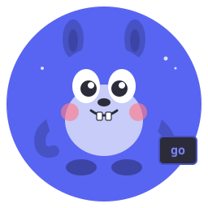

<p align="center">
  
</p>

<h1 align="center">discord.go</h1>

<p align="center">
  A typed Go library for building Discord applications.<br>
  Low-level Discord API foundation and high-level bot facade.
</p>

<p align="center">
  <strong>Current release:</strong> <code>v0.9.0-beta.5</code>
</p>

---

This is a public beta. The API is usable for bot applications, but the project
does not yet claim complete official Discord REST endpoint and model coverage.

## Features

- Discord Gateway v10 dispatch, heartbeat, reconnect, resume, compression, and sharding.
- Typed REST resources, authentication modes, rate limits, retries, audit reasons, and multipart uploads.
- Slash commands, context menus, prefix commands, aliases, middleware, cooldowns, collectors, buttons, select menus, modals, autocomplete, and Components V2.
- Voice WebSocket, UDP, RTP, encryption, DAVE, Opus transport, and main-Gateway voice-state helpers.
- Typed models for applications, guilds, channels, threads, users, members, roles, messages, webhooks, stickers, emojis, AutoMod, scheduled events, soundboard, and entitlements.
- Cache interfaces, persistence interfaces, OAuth2 helpers, CDN builders, and production-oriented error handling.

## Installation

```bash
go get github.com/discord-go/discord.go
```

## Quick Start

```go
package main

import (
    "log"
    "os"

    "github.com/discord-go/discord.go/bot"
    "github.com/discord-go/discord.go/intents"
)

func main() {
    token := os.Getenv("DISCORD_TOKEN")
    if token == "" {
        log.Fatal("DISCORD_TOKEN is required")
    }

    router := bot.NewRouter()
    router.Command("ping", "Check bot status", func(ctx *bot.InteractionContext) {
        if err := ctx.Reply("Pong!"); err != nil {
            log.Printf("reply: %v", err)
        }
    })

    client := bot.New(token,
        bot.WithIntents(intents.Guilds),
        bot.WithRouter(router),
    )
    if err := client.Run(); err != nil {
        log.Fatal(err)
    }
}
```

## Documentation

The complete tutorial site is under [`docs/`](docs/). Start with the high-level
[`bot` guides](docs/high-level/) for application code or the
[`low-level guides`](docs/low-level/) for protocol and REST work. Runnable
examples are organized under [`docs/examples/`](docs/examples/).

## Development

```bash
go test ./...
go test -race ./...
go vet ./...
```

Nested example modules can be tested independently from their directories.
See [`CONTRIBUTING.md`](CONTRIBUTING.md) before opening a pull request.

## Security

Never commit bot tokens, OAuth client secrets, webhook tokens, database
credentials, or generated coverage and build artifacts. Report security issues
privately to the maintainers rather than opening a public issue.

## License

This project is licensed under the [Apache License 2.0](LICENSE).
